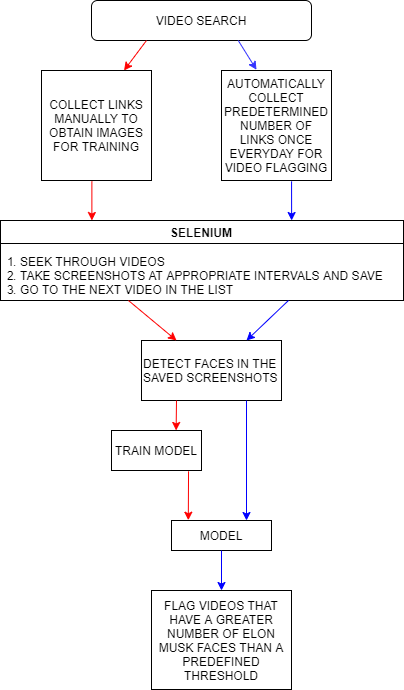

# **Musk Notifier**
#### Click [here](https://anuragtk88.github.io/Projects/MuskNotifier/Deployer.html) to view the code and its working in more detail.

This is a script to find those videos on YouTube that have Elon Musk in person. Why is this necessary?     
Because there are a lot of videos on YouTube that have "Elon Musk" in their names but do not actually have him in person. How to go about solving this problem?    
The following flowchart depicts it in further detail. The red arrows represent the training workflow and the blue arrows represent the deployment workflow.  

 
*I chose to work on this project as it involves varying aspects such as web scraping, data collection, cleaning, augmentation, training, and deployment.*
